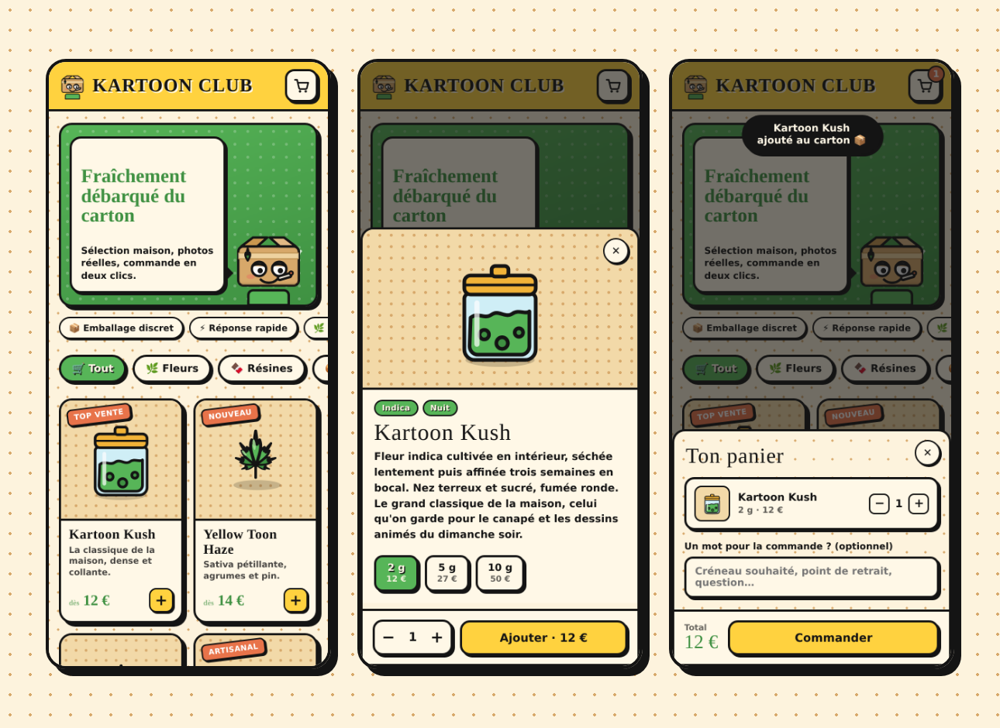
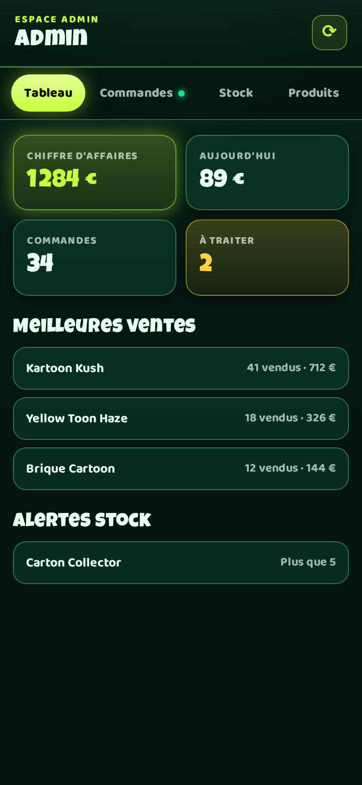

# 🌿 COFFEE SHOP 68 — boutique Telegram Mini App

Une boutique au **design néon nuit** qui s'ouvre directement dans Telegram : catalogue en
images, fiches produits, panier, et un bouton **Commander** qui ouvre ta conversation
Telegram avec le récapitulatif de la commande déjà écrit.



---

## Comment ça marche

```
Client → /start dans le bot → bouton « Ouvrir la boutique »
       → Mini App (catalogue, panier)
       → « Commander » → ta conversation Telegram, message pré-rempli
                       → (en parallèle) commande enregistrée + notification admin
```

Le client n'a plus qu'à appuyer sur « Envoyer » : tu reçois la commande dans ta
messagerie perso, avec le détail et une référence.

---

## Mise en route

### 1. Créer le bot

1. Sur Telegram, écris à **[@BotFather](https://t.me/BotFather)**.
2. `/newbot` → choisis un nom et un identifiant (`ma_boutique_bot`).
3. BotFather te donne un **token** du type `123456:ABC-DEF...` → garde-le secret.

### 2. Installer le projet

```bash
git clone <ce-dépôt>
cd Telegram-app
npm install
cp .env.example .env
```

Ouvre `.env` et remplis :

| Variable | À quoi ça sert |
|---|---|
| `BOT_TOKEN` | Le token donné par BotFather |
| `WEBAPP_URL` | L'URL **HTTPS** publique de la boutique (obligatoire, Telegram refuse le HTTP) |
| `SELLER_USERNAME` | **Ton pseudo Telegram sans le `@`** — c'est là qu'arrivent les commandes |
| `ADMIN_CHAT_ID` | Ton ID numérique, pour recevoir aussi une notification automatique du bot |
| `SHOP_NAME` | Le nom affiché en haut de la boutique |
| `CURRENCY` | `EUR`, `CHF`, `CAD`… |

> Pour trouver ton `ADMIN_CHAT_ID` : lance le bot, envoie-lui `/start`, il t'affiche ton ID.

### 3. Lancer

```bash
npm start
```

La boutique est servie sur `http://localhost:3000`, le bot démarre en parallèle.

### 4. Exposer en HTTPS

Telegram n'ouvre une Mini App que derrière une URL **HTTPS**. Pour tester depuis ton
téléphone sans déployer :

```bash
npx cloudflared tunnel --url http://localhost:3000
# ou : ngrok http 3000
```

Copie l'URL `https://…` obtenue dans `WEBAPP_URL`, puis relance `npm start`.

Pour de la mise en production, n'importe quel hébergeur Node avec HTTPS fait l'affaire
(Railway, Render, Fly.io, un VPS derrière Caddy ou Nginx…).

### 5. Brancher le bouton dans Telegram

Chez **@BotFather** :

- `/mybots` → ton bot → **Bot Settings** → **Menu Button** → **Configure menu button**
- colle ton `WEBAPP_URL` et donne un libellé (« 🛒 Boutique »)

Le bouton apparaît alors en permanence à côté du champ de saisie du bot.

---

## ⚙️ Espace admin



Envoie `/admin` au bot (réservé aux identifiants listés dans `ADMIN_IDS`) : la
Mini App d'administration s'ouvre avec quatre onglets.

| Onglet | Ce que tu y fais |
|---|---|
| **Tableau** | Chiffre d'affaires total et du jour, nombre de commandes, commandes à traiter, meilleures ventes, alertes de stock bas |
| **Commandes** | Toutes les commandes, filtrables par statut, avec les boutons pour les faire avancer |
| **Stock** | Réglage direct des quantités, format par format, avec recherche |
| **Produits** | Créer, modifier, masquer ou supprimer un produit |

### Le cycle d'une commande

```
Nouvelle ──▶ Confirmée ──▶ Prête ──▶ Livrée
    │            │           │
    └────────────┴───────────┴──▶ Annulée   (le stock est remis en rayon)
```

Le client reçoit **automatiquement un message du bot** à chaque changement de statut.
Les transitions illégales sont refusées côté serveur : on ne passe pas de
« Nouvelle » directement à « Livrée ».

### Le stock

- Chaque produit a un stock ; s'il a des formats (2 g, 5 g…), le stock est tenu
  **par format**.
- Une commande **décrémente le stock en tout ou rien** : deux clients ne peuvent
  pas emporter le dernier article en même temps.
- Un produit épuisé apparaît **grisé et non commandable** dans la boutique, et
  le format épuisé est barré dans la fiche produit.
- Le tableau de bord signale tout ce qui descend **à 5 unités ou moins**.
- Annuler une commande **remet automatiquement les articles en rayon**.

---

## Personnaliser

### Les produits

Le plus simple est de passer par l'**espace admin** (`/admin` dans le bot) : tout se
modifie depuis le téléphone, sans toucher au code.

Au premier démarrage, le catalogue est créé dans `server/data/catalog.json` à partir
du catalogue d'exemple de **`server/data/products.js`**. Ensuite c'est le fichier JSON
qui fait foi. Pour repartir du catalogue d'exemple, supprime `catalog.json` et
redémarre. Une entrée ressemble à ça :

```js
{
  id: 'neon-kush',               // identifiant unique, sans espaces
  name: 'Néon Kush',
  category: 'fleurs',            // doit exister dans `categories`
  price: 1200,                   // EN CENTIMES : 1200 = 12,00 €
  image: '/assets/products/jar.svg',
  badge: 'TOP VENTE',            // pastille rose, optionnelle
  tags: ['Indica', 'Nuit'],
  short: 'Texte court affiché sur la vignette.',
  description: 'Texte long affiché dans la fiche produit.',
  stock: null,                   // null si le stock est porté par les variantes
  variants: [                    // optionnel : formats au choix
    { id: '2g', label: '2 g', price: 1200, stock: 24 },
    { id: '5g', label: '5 g', price: 2700, stock: 12 },
  ],
}
```

> ⚠️ Les prix sont **en centimes** pour éviter les erreurs d'arrondi, et ils sont
> systématiquement **recalculés côté serveur** : un client ne peut pas se commander
> un produit à 0 €.

### Les images

Les illustrations sont des SVG originaux dans `webapp/assets/products/`, générés par
`node tools/generate-art.mjs` (dégradés doux, pensés pour un fond sombre).
**Le plus simple : envoie la photo au bot.** Depuis un compte administrateur,
envoie l'image dans la conversation avec le nom du produit en légende :

```
[photo]  Néon Kush
```

Le bot répond « Photo mise à jour ». Le fichier reste chez Telegram — la
boutique n'enregistre que sa référence et sert l'image à la demande. Rien à
écrire sur le disque : ça marche aussi bien sur un VPS qu'en serverless, et il
n'y a rien de plus à sauvegarder. Une légende ambiguë (« neon » quand deux
produits le contiennent) fait répondre la liste plutôt que d'écraser la
mauvaise photo.

**Ou par fichier**, deux autres chemins :

- depuis l'espace admin : dans l'éditeur de produit, choisis « 📷 Ma photo » dans la
  liste d'images et colle le chemin (`/assets/products/ma-photo.jpg`) ou une adresse
  complète ;
- ou directement dans `server/data/products.js`, champ `image`.

Dépose les fichiers dans `webapp/assets/products/`. La boutique reconnaît une photo à
son extension et l'affiche alors plein cadre (recadrage centré), au lieu du halo
réservé aux illustrations. Un format carré, sujet centré, rend le mieux dans la
grille ; les deux peuvent cohabiter dans le même catalogue.

### Les couleurs

Toute la palette tient dans le premier bloc de `webapp/css/style.css`, en composantes
RVB brutes (pour pouvoir moduler l'opacité) :

```css
--night-rgb:   4 22 15;    /* fond de page */
--panel-rgb:  12 62 41;    /* cartes et panneaux */
--neon-rgb: 198 255 61;    /* accent principal : boutons, sélection */
--halo-rgb:  15 157 99;    /* fumée du fond */
--gold-rgb: 255 210 63;    /* lettrage d'affiche */
```

Réécris ce bloc et toute la boutique change de couleurs — l'espace admin et la barre
native de Telegram suivent, ils lisent les mêmes variables.

### Les polices

`Luckiest Guy` (lettrage d'affiche) et `Baloo 2` (texte) sont servies depuis
`webapp/assets/fonts/` : pas de dépendance à Google Fonts dans la WebView. Voir
`webapp/assets/fonts/NOTICE.txt` pour les licences (SIL OFL 1.1).

---

## Mise en ligne

Deux chemins, selon ce que tu as sous la main :

- **Un VPS** (Debian/Ubuntu) — le plus simple : le bot tourne en long polling,
  le catalogue vit dans des fichiers JSON, rien d'autre à installer.
  👉 **[Guide pas à pas : docs/vps.md](docs/vps.md)**
- **Vercel** (serverless) — voir la section ci-dessous : le bot passe en
  webhook et le stockage en Postgres, car le disque y est en lecture seule.

---

## Mise en ligne sur Vercel

En local, la boutique tourne telle quelle : fichiers JSON dans `server/data/` et
bot en long polling. En ligne sur Vercel, deux choses changent — le disque y est
en lecture seule et aucun process ne vit entre deux requêtes :

| | En local | Sur Vercel |
|---|---|---|
| Stockage | `server/data/*.json` | Postgres (`DATABASE_URL`) |
| Bot | long polling | webhook `/api/telegram` |

Le code choisit tout seul : `server/store.js` bascule sur Postgres dès que
`DATABASE_URL` est défini, et `server/index.js` n'écoute un port que s'il est
lancé directement. Rien à commenter, rien à dupliquer.

### 1. Une base Postgres

Crée une base chez Neon, Supabase ou Vercel Postgres et récupère la chaîne de
connexion **« pooled »** (celle qui passe par le pooler du fournisseur). La table
`shop_documents` est créée automatiquement au premier appel — aucune migration à
lancer.

### 2. Le projet Vercel

Importe le dépôt sur Vercel (aucune commande de build : `vercel.json` sert
`webapp/` en statique et route `/api/*` vers la fonction), puis renseigne les
variables d'environnement du projet :

```
BOT_TOKEN=…                        (BotFather)
WEBAPP_URL=https://ton-projet.vercel.app
SELLER_USERNAME=tonpseudo
ADMIN_IDS=123456789
ADMIN_CHAT_ID=123456789
DATABASE_URL=postgres://…?sslmode=require
TELEGRAM_WEBHOOK_SECRET=…          (openssl rand -hex 32)
```

### 3. Le webhook

Une fois le déploiement en ligne, déclare le webhook une bonne fois :

```bash
BOT_TOKEN=… WEBAPP_URL=https://ton-projet.vercel.app TELEGRAM_WEBHOOK_SECRET=… \
  node tools/set-webhook.mjs
```

`--info` affiche l'état vu par Telegram, `--delete` le retire pour repasser au
long polling en local. Un webhook déclaré et un `npm start` local se disputent
les mêmes mises à jour : garde-en un seul actif à la fois.

### 4. Vérifier

```bash
npm run doctor                       # ou : node tools/doctor.mjs https://…
```

Le diagnostic contrôle la configuration, appelle `/api/health` sur le
déploiement (stockage joignable, nombre de produits), vérifie que la Mini App
est bien servie et demande à Telegram où pointe le webhook. `/api/health` est
aussi consultable directement dans un navigateur — il ne renvoie que des
booléens et des compteurs, jamais un token.

### 5. Enfin

Chez BotFather, `/setmenubutton` avec la même URL `WEBAPP_URL`, puis `/start`
dans ton bot.

> ⚙️ **Pourquoi le corps des requêtes est repris à la main** : le runtime de
> Vercel lit la requête avant la fonction, si bien que `express.json()` trouve
> un flux déjà terminé et répond « stream is not readable ». Un filtre en tête
> de `server/index.js` récupère le corps déjà analysé ; `test/vercel-compat.test.mjs`
> rejoue ce comportement pour que la protection ne saute pas par mégarde.

> Les commandes et le catalogue sont stockés en JSONB, un document par magasin,
> et chaque écriture verrouille sa ligne le temps de la transaction : deux
> clients ne peuvent pas acheter le même dernier article. Au-delà de quelques
> dizaines de milliers de commandes, passe à une ligne par commande — seul
> `server/pg-store.js` est à revoir.

---

## Commandes du bot

| Commande | Effet |
|---|---|
| `/start` | Message d'accueil + bouton boutique + affiche l'ID du client |
| `/boutique` | Rouvre la Mini App |
| `/commandes` | Les 5 dernières commandes du client |
| `/aide` | Liste des commandes |
| `/admin` | Espace d'administration (réservé aux `ADMIN_IDS`) |
| `/ouvrir` `/fermer` | Ouvre ou ferme la boutique (réservé) |
| `/verification on\|off` | Allume ou coupe la vérification d'identité (réservé) |

Tout autre message reçoit la liste des commandes et le bouton boutique : la
porte d'entrée de la boutique ne doit pas rester muette devant un « bonjour ».

---

## Sécurité

- Le `initData` envoyé par Telegram est **vérifié par HMAC-SHA256** (`server/telegram-auth.js`) :
  impossible de passer une commande en se faisant passer pour quelqu'un d'autre.
- Les signatures ont une **durée de vie de 24 h** pour éviter le rejeu.
- Les **prix et les variantes sont revalidés côté serveur** à partir du catalogue.
- Le `BOT_TOKEN` n'est jamais envoyé au navigateur (`.env` est dans `.gitignore`).
- L'espace admin est verrouillé sur les identifiants de `ADMIN_IDS`, vérifiés à
  **chaque appel** à partir de la signature Telegram : un client ne peut pas se
  déclarer administrateur.

Tests automatisés — 45 tests couvrant l'authentification, la falsification de prix,
les droits d'admin, la gestion du stock, les transitions de statut, la concurrence
(cinq clients sur le dernier article) et la compatibilité serverless — serveur
démarré dans un autre terminal :

```bash
npm test
```

La même suite passe sur les deux stockages : lance le serveur sans `DATABASE_URL`
pour tester les fichiers JSON, avec pour tester Postgres.

---

## Stockage des commandes

Le catalogue et les commandes sont écrits dans `server/data/catalog.json` et
`server/data/orders.json` (créés automatiquement, ignorés par git). Les écritures
sont sérialisées et atomiques : pas de JSON tronqué si le serveur s'arrête en
pleine sauvegarde.

En ligne avec `DATABASE_URL`, c'est `server/pg-store.js` qui prend le relais : un
document JSONB par magasin, et chaque écriture verrouille sa ligne le temps de la
transaction. Les deux magasins exposent la même interface, `server/store.js`
choisit — le reste du serveur ignore lequel tourne.

> ⚠️ **Avec les fichiers JSON, une seule instance.** Chaque processus garde les
> données en mémoire et réécrit le fichier entier : deux instances sur le même
> dossier ne se voient pas, et la seconde efface silencieusement ce que la
> première vient d'écrire — commandes comprises. La boutique **refuse donc de
> démarrer** si une autre instance tient déjà le dossier (`server/data/.lock`).
> Pour servir depuis plusieurs processus — `pm2 -i 2`, plusieurs conteneurs,
> ou le serverless — il faut `DATABASE_URL` : Postgres verrouille la ligne le
> temps de la transaction, et deux instances peuvent travailler ensemble sans
> se marcher dessus. C'est vérifié par un test qui fait tourner deux serveurs
> sur la même base et leur fait disputer le dernier article, le dernier
> créneau et un code à usage unique.

> 💾 **En local, pense à sauvegarder `server/data/`** : c'est là que vivent ton
> catalogue et tes commandes. En ligne, c'est la base Postgres qu'il faut
> sauvegarder (la plupart des fournisseurs le font pour toi).

---

## Exploitation au quotidien

Tout se règle depuis l'onglet **Réglages** de l'espace admin, sans redéployer.

### Fonctionnalités

Le premier bloc de l'onglet Réglages est un tableau de bord : **une case par
fonctionnalité**, qui s'applique immédiatement — pas de bouton « Enregistrer »,
car une case cochée mais pas encore enregistrée est un piège.

| Fonctionnalité | Ce qui disparaît quand elle est coupée |
|---|---|
| Porte d'âge | l'écran « as-tu 18 ans ? » |
| Épreuve anti-robot | la grille de tuiles avant de commander |
| Vérification d'identité | la demande de pièce dans le bot |
| Horaires automatiques | la fermeture programmée (l'interrupteur manuel reste) |
| Zones de livraison | on livre partout aux conditions générales |
| Créneaux | plus de plage horaire à choisir |
| Remises par palier | plus de remise automatique |
| Codes promo | le champ « code promo » du panier |
| Liste d'attente | le bouton « préviens-moi du retour » |
| Alertes de stock | le bot ne te signale plus les seuils franchis |
| Garde-fous anti-abus | plus de plafond horaire ni d'articles |
| Photos par le bot | envoyer une photo au bot ne change plus rien |
| « Mes commandes » | l'écran d'historique du client |
| Suivi envoyé au client | confirmation et messages de statut |

Deux règles tiennent tout ça :

> 🔒 **Ce qui est éteint est refusé par le serveur**, pas seulement masqué dans
> la Mini App. Chaque case est vérifiée dans une route ou un envoi — cacher un
> bouton ne fermerait rien, l'appel resterait possible.

> 💾 **Les réglages d'une fonctionnalité éteinte sont conservés.** Couper les
> créneaux ne vide pas la grille de la semaine, couper les zones ne les efface
> pas : rallumer retrouve tout intact.

Le vendeur, lui, est prévenu de chaque commande quoi qu'il arrive : c'est lui
qui la prépare. Seul le fil du client est optionnel.

### Ouverture

Un interrupteur immédiat (`/ouvrir` et `/fermer` marchent aussi depuis la
conversation) et, si tu veux, des **horaires hebdomadaires** avec ton fuseau :
la boutique se ferme alors toute seule le soir. Une plage qui franchit minuit
(22:00 → 02:00) est comprise des deux côtés.

Fermée, la boutique reste consultable — le client prépare son panier et voit
un bandeau — mais **le serveur refuse les commandes** : un bandeau seul
n'empêcherait pas de valider un panier resté ouvert.

### Retrait et livraison

| Réglage | Effet |
|---|---|
| Retrait / Livraison | les modes proposés ; il en faut au moins un |
| Frais de livraison | ajoutés au total, **recalculés côté serveur** |
| Livraison offerte dès | franco : au-delà, les frais tombent à zéro |
| Commande minimum | en dessous, le bouton Commander reste fermé |

Une commande en livraison exige une adresse. Le mode, le sous-total et les
frais sont enregistrés avec la commande, et repris dans le message envoyé au
vendeur.

### Zones de livraison

Tant qu'aucune zone n'est déclarée, tu livres partout aux conditions
ci-dessus. Dès qu'il y en a une, **seuls les codes postaux listés sont
desservis** : le client saisit le sien dans le panier et voit immédiatement
« Colmar centre · 3 € de livraison » ou « on ne livre pas encore le 75000 »,
au lieu de valider une commande que tu devras annuler.

| Champ de la zone | Laissé vide |
|---|---|
| Frais | gratuit pour cette zone |
| Minimum | celui de la boutique |
| Franco | celui de la boutique |

Le secteur et le code postal sont enregistrés avec la commande et repris dans
le message que tu reçois.

### Créneaux

Un interrupteur, puis une grille : par jour de la semaine, des plages avec une
capacité. Le client choisit dans une liste des jours à venir, et la commande
porte son créneau — tu vois d'un coup d'œil l'ordre de préparation.

- **Délai avant un créneau** : on ne réserve pas celui qui commence dans cinq
  minutes. Il ne s'applique qu'à la journée en cours.
- **Jours proposés** : la profondeur de la fenêtre, jusqu'à quatorze jours.
- **Capacité** : une fois atteinte, le créneau s'affiche « complet » et
  **le serveur refuse de le surbooker** (HTTP 409). Il reste visible : le
  faire disparaître donnerait l'impression d'un bug à qui l'avait vu une
  minute plus tôt.

Une commande annulée **libère sa place** : compter les annulations reviendrait
à bloquer un créneau pour un client qui ne viendra pas. Le créneau demandé est
revalidé au moment de commander contre la liste que la boutique proposerait à
cet instant — une page restée ouverte toute la nuit ne peut donc pas réserver
un créneau d'hier.

### Remises et codes promo

Deux mécanismes, dans l'onglet Réglages :

- **Paliers automatiques** (cinq au maximum) : « −10 % dès 100 € ». Ils sont
  publics — la boutique les annonce dans le panier et dit ce qu'il manque pour
  atteindre le suivant.
- **Codes promo** : pourcentage ou montant fixe, avec panier minimum, date
  d'expiration, nombre d'usages et option « une seule fois par client ».

> 🧮 **Un client ne cumule jamais les deux : la meilleure des deux remises
> s'applique.** Cumuler ouvre la porte aux additions surprises (un code de 20 %
> sur un panier déjà remisé de 15 %) et rend le prix impossible à expliquer au
> téléphone. Si le code saisi est moins avantageux que le palier, la boutique
> le dit et garde le palier.

Le minimum de commande et le franco de livraison se jugent sur le panier
**avant remise** : un code ne doit pas faire repasser une commande sous le
minimum qu'elle venait d'atteindre. Le code n'est décompté qu'une fois la
commande écrite, et le montant de la remise est recalculé côté serveur — celui
envoyé par le client est ignoré.

### Alertes de stock

Deux sens, réglés par un seul seuil (onglet Réglages) :

- **Vers toi** : dès qu'une commande fait passer un article sous le seuil, le
  bot t'écrit. Tu ne découvres plus la rupture en lisant une commande.
- **Vers le client** : sur un article épuisé, un bouton « préviens-moi du
  retour ». Dès que tu réassortis — ou qu'une annulation remet l'article en
  rayon — le bot écrit à ceux qui attendaient, et la liste se vide.

La liste ne garde qu'un identifiant Telegram par ligne de catalogue, et le
message ne part qu'au franchissement de zéro : passer de 2 à 5 n'intéresse
personne.

---

## Contrôles à l'entrée

Deux portes, indépendantes, activables depuis l'espace admin (onglet Réglages).

### Épreuve anti-robot

Une grille de neuf tuiles à résoudre avant de pouvoir commander, vérifiée côté
serveur. À noter : la vraie barrière contre les robots reste la signature
Telegram contrôlée à chaque appel — sans compte Telegram, aucune commande.
L'épreuve ajoute une friction et un geste conscient à l'entrée. Activée par
défaut, elle se coupe d'une case.

### Vérification d'identité

Quand elle est active, un client doit faire valider une pièce d'identité avant
de commander. Le client l'envoie en photo dans la conversation du bot ; le
vendeur la reçoit avec deux boutons, **Valider** ou **Refuser**.

> 🔐 **Le document n'est ni téléchargé ni conservé par la boutique.** Il reste
> dans la conversation Telegram, et le serveur n'enregistre que le verdict :
> statut, date de la demande, date et auteur de la décision. Aucune référence
> au fichier n'est gardée. Supprime le message une fois la décision prise.

Une pièce d'identité est une donnée personnelle sensible : n'active cette
vérification que si la loi de ton pays l'exige pour ce que tu vends, et
n'en conserve pas plus que le verdict.

Le pilotage se fait aussi depuis le bot :

```
/verification        → l'état actuel, avec les boutons
/verification on     → activer
/verification off    → désactiver
```

---

## ⚖️ Cadre légal

Ce dépôt est un **modèle de boutique** : le code ne présume rien de ce que tu vends.

La vente de produits à base de cannabis est **encadrée ou interdite selon les pays et
les régions**. Avant toute mise en ligne, vérifie ce que la loi autorise là où tu te
trouves et où sont tes clients, et procure-toi les autorisations nécessaires.
Un contrôle d'âge 18+ et un bandeau d'information sont intégrés, mais ils ne
remplacent pas une vérification d'identité réelle ni une licence de vente.

Les illustrations sont des créations originales : aucun personnage sous droits
d'auteur n'est utilisé, la boutique est donc publiable telle quelle.
